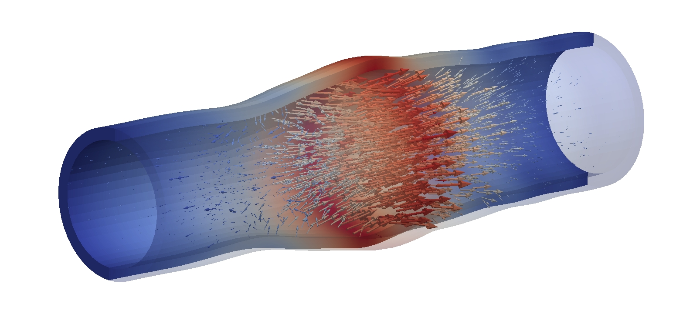

# Introduction to monolithic fluid/solid interaction in 4C

This tutorial demonstrates the simulation of a fluid/solid interaction (FSI) problem using a monolithic approach. The solid domain is governed by the equations of elastodynamics, whil the flow domain is subject to incompressible Navier-Stokes equations described by an Arbitrary Lagrangean-Euelerian (ALE) observer.

As concrete example, this tutorial studies a pressure wave through an elastic tube. This problem has originally been introduced by Gerbeau and Vidrascu (2003) [1] and is designed to mimic hemodynamic
conditions, especially w.r.t. to the material densities with the ratio $\rho^S/\rho^F \approx 1$. Nowadays, it is widely considered a benchmark for monolithic solvers in the FSI community.

## Problem description

The system consists of a straight, thin-walled solid tube (length $\ell = 5 cm$, outer radius $r_o = 0.6 cm$, inner radius $r_i = 0.5 cm$) that is filled with fluid. The solid tube is fully clamped at both ends. Both solid and fluid are initially at rest.

As external excitation, the fluid surface at $z = 0$ is loaded with a surface traction $h^F = 1.3332\cdot 10^4 g\cdot cm/s^2$ in $z$-direction for the duration of $3\cdot 10^{−3} s$. The fluid velocities at $z=\ell$ are prescribed to zero, essentially closing the tube at the far end.

The pressure pulse travels along the longitudinal axis of the tube, causing a traveling radial dilation of the tube:



## Model setup in 4C

To create a 4C model and input file, at least two ingredients are required:

- The finite element mesh in a suitable mesh format
- A `*.4C.yaml` file will all simulation parameters and boundary conditions

This tutorial comes with ready-to-use mesh files, so that the focus can be put on creating input files for 4C simulations.

### Predefined Mesh Files

This tutorial comes with a series of ready-to-use meshes with different mesh resolutions.
The following meshes are available (along with recommendation for the number of MPI ranks to run each mesh):

| Filename  | Global number of DOFs | MPI ranks |
|-----------|-----------------------|-----------|
| pw_m1.exo | 8406                  | 1         |
| pw_m2.exo | 58333                 | 2         |
| pw_m3.exo | 187516                | 8         |

Each mesh file contains both solid and fluid mesh. See for example the mesh `pw_m2.exo`:


The mesh contains the following node sets:

| Node Set ID | Node Set Name           | Description |
|-------------|-------------------------|-------------|
| 1           | solid_fsi_surf          | FSI interface of the solid domain |
| 2           | fluid_fsi_surf          | FSI interface of the fluid domain |
| 3           | solid_clamp_surf        | Fully constrained solid surfaces at both ends of the tube |
| 4           | fluid_inflow_surf       | Fluid surface subject to the pressure pulse |
| 5           | fluid_outflow_surf      | Fluid surface at the other end of the tube |
| 6           | solid_fsi_no_dbc_curves | Solid nodes at the intersection of Dirichlet boundary and FSI interface |
| 7           | fluid_fsi_no_dbc_curves | Fluid nodes at the intersection of Dirichlet boundary and FSI interface |

Both solid and fluid are meshed with eight-noded hexahedral elements to support a finite element basis with 1st order Lagrange polynomials.

### Creating the 4C input file

You will now create the 4C input file. Therefore, create a new file entitled `pw.4C.yaml`.
Now, insert the first set of simulation parameters:

- Define the problem type in order to solve a fluid/solid interaction problem:

   ```yaml
   PROBLEM TYPE:
     PROBLEMTYPE: "Fluid_Structure_Interaction"
   ```

- Define the spatial dimension:

   ```yaml
   PROBLEM SIZE:
      DIM: 3
   ```

In order to solve an FSI problem, you now need to define the involved single fields (solid, fluid, ALE mesh motion)
as well as the interaction among them.
First, let's define the individual fields:

- Solid:

   ```yaml
   STRUCTURAL DYNAMIC:
     INT_STRATEGY: "Old"
     LINEAR_SOLVER: 1
   ```

- Define a **fluid** field:

   ```yaml
   FLUID DYNAMIC:
     LINEAR_SOLVER: 1
     TIMEINTEGR: "Np_Gen_Alpha"
     ALPHA_M: 0.5
     ALPHA_F: 0.5
     GAMMA: 0.5
     NONLINITER: Newton
     GRIDVEL: BDF2
   ```

   It performs time integration via the Generalized-alpha scheme [3].
   The nonlinear problem in each time step is solved by a Newton method.
   A 2nd-order backward differentiation formula (BDF2) is used to approximate the grid velocity in the ALE description of the Navier-Stokes equations based on the ALE Mesh discplacements.

- The mesh motion problem of the ALE formulation of the fluid domain is defined as follows:

   ```yaml
     ALE DYNAMIC:
       ALE_TYPE: springs_material
       LINEAR_SOLVER: 1
    ```

### Boundary conditions

### Linear solver

#### Direct solver

#### Iterative solver with algebraic multigrid preconditioning

[2]

---

[1] J.-F. Gerbeau and M. Vidrascu. A quasi-Newton algorithm based on a reduced model for fluid-
structure interaction problems in blood flows. ESAIM: Mathematical Modelling and Numerical Analysis (Mod´elisation Math´ematique et Analyse Num´erique), 37(4):631–647, 2003

[2] M. W. Gee, U. Küttler, and W. A. Wall. Truly monolithic algebraic multigrid for fluid–structure interaction. International Journal for Numerical Methods in Engineering, 85(8):987–1016, 2011

[3] K. E. Jansen, C. H. Whiting, and G. M. Hulbert. A generalized-α method for integrating the filtered
Navier–Stokes equations with a stabilized finite element method. Computer Methods in Applied Mechanics
and Engineering, 190(3–4):305–319, 2000
